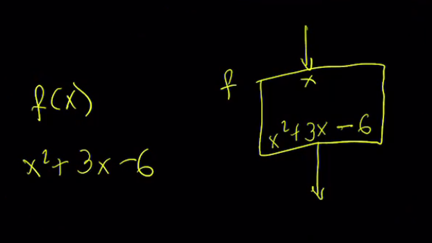
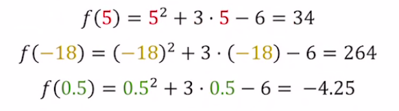
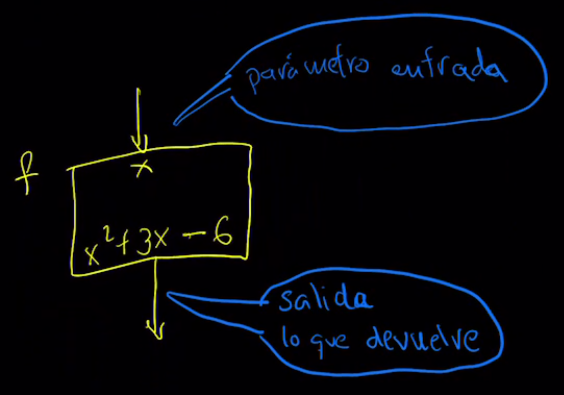
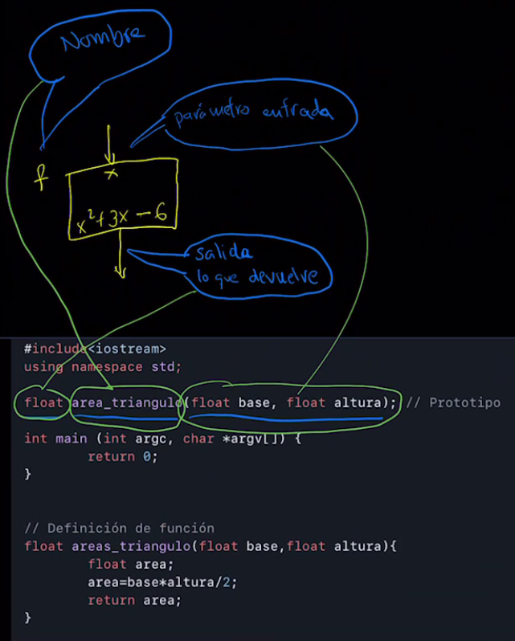
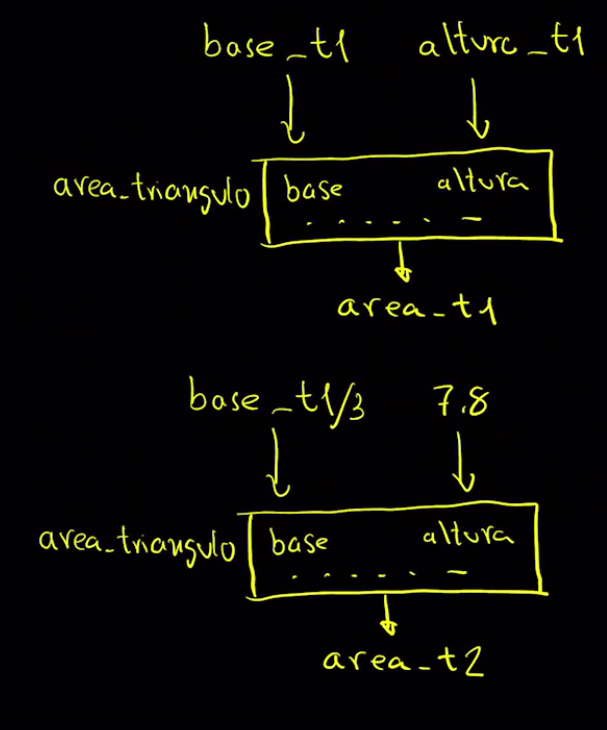

Leer antes la práctica.

Usar / Crear

* Una cosa es saber usar. Otra cosa es saber crear.
* Concepto de caja negra / TV.

Utilidad: 
* Factor común.
* La programación es el arte de mover código poco a poco.








```cpp
#include<iostream>
using namespace std;

float area_triangulo(float base, float altura); // Prototipo

int main (int argc, char *argv[]) {	
	return 0;
}


// Definición de función
float area_triangulo(float base,float altura){
	float area;
	area=base*altura/2;
	return area;
}
```



* Hay que indicar ¿qué se devuelve?, float, se ponde delante.
  * Tanto el la función.
  * Tanto en los parámetros.  
* Lo parámetros se separan por comas.
* El *Prototipo* es como ver la caja desde fuera.
* La *Definición* es el interior.
  * Las llaves {} representan una caja.
  * Recibe el nombre de cuerpo.
* Recuerda: Es el mismo orden en el que se pinta la caja, salvo que el tipo va primero, y la caja son llaves.
* ¿Qué fallo hay en este código?

# ¿Por qué existe el prototipo?
* Es un índice.
* Una forma de solucionar los problemas de huevo-gallina.
  * Porque las funciones pueden ser construidas por otras funciones.
  * Escribir el código sin prototipos es posible. Difícil cuando crece el código. No imposible.
* Es mas claro, leer el main, y luego los detalles.

# ¿Qué había antes de las funciones?

```basic
10 REM Programa en GWBASIC para calcular el área de un triángulo
20 REM Usando GOSUB y GOTO sin funciones modernas

30 REM Solicitar valores al usuario
40 PRINT "Introduce la base del triángulo: "
50 INPUT B
60 PRINT "Introduce la altura del triángulo: "
70 INPUT H

80 REM Calcular el área del triángulo
90 GOSUB 200

100 REM Mostrar el resultado
110 PRINT "El área del triángulo es: "; A
120 END

200 REM Subrutina para calcular el área
210 A = (B * H) / 2
220 RETURN
```
# Llamada
```cpp

int main (int argc, char *argv[]) {	
	cout << area_triangulo(3.5, 4.7);
	return 0;
}

```

# Códigos equivalentes
Desde la forma más compacta hasta la más extendida.

```cpp
cout << area_triangulo(3.5, 4.7);

float area=area_triangulo(3.5, 4.7);
cout << area;

float area;
area=area_triangulo(3.5, 4.7);
cout << area;

float base=3.5,altura=4.7;
float area;
area=area_triangulo(base, altura);
cout << area;

float base,altura;
base=3.5; 
altura=4.7;
float area;
area=area_triangulo(base, altura);
cout << area;
```

# Errores comunes
1. No respetar los tipos.
2. No capturar lo que devuelve la función.

# Ejemplo con dos llamadas

```cpp
#include <iostream>
using namespace std;

float area_triangulo(float base, float altura); // Prototipo

int main(int argc, char *argv[]) {
	float altura_t1, base_t1, area_t1, area_t2;
	altura_t1 = 4.5; base_t1 = 5.5;
	area_t1 = area_triangulo(base_t1, altura_t1); // Una llamada a la función
	area_t2 = area_triangulo(base_t1/3, 7.8); // Otra llamada, distintos valores
	cout << "El área del triángulo 1 es:" << area_t1 << endl;
	cout << "El área del triángulo 2 es:" << area_t1 << endl;
	return 0;
}

// Definición de la función
float area_triangulo(float base, float altura){ 
	float area;
	area = base*altura/2;
	return area;
}
```

Fijate en los nombres, viven entre llaves, dentro de su caja. Son locales.

Son reemplazados en la llamada.



Una cosa es entender. Otra cosa es saber crear.

# Usar librerías de otros

```cpp
#include <iostream>
#include <fstream>

using namespace std;
#include <cmath>
int main(int argc, char *argv[]){
	float a=8;
	cout<<"a al cubo (a^3) es:"<<pow(a,3)<<endl;
	cout<<"la raíz cuadrada de a es:"<<<sqrt(a);
}
´´´